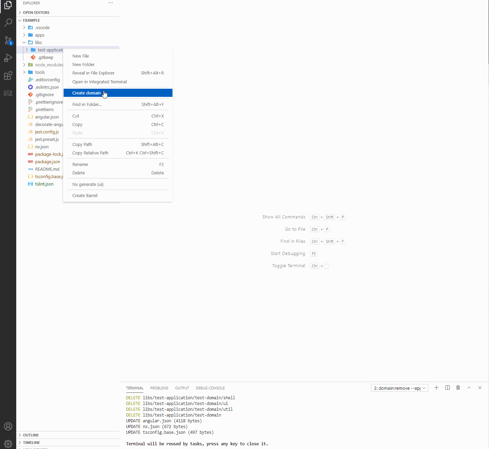
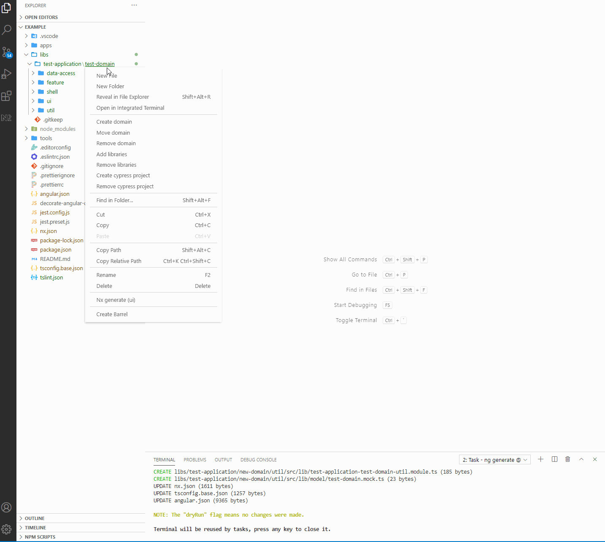
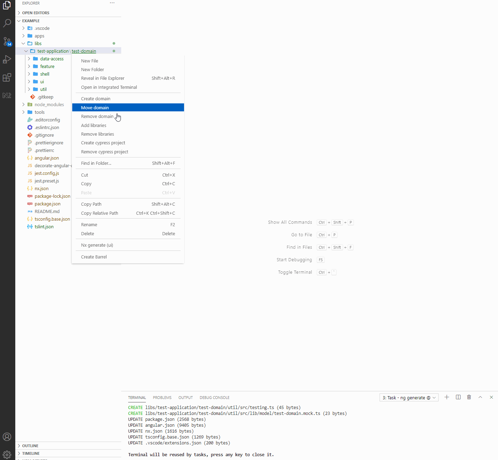
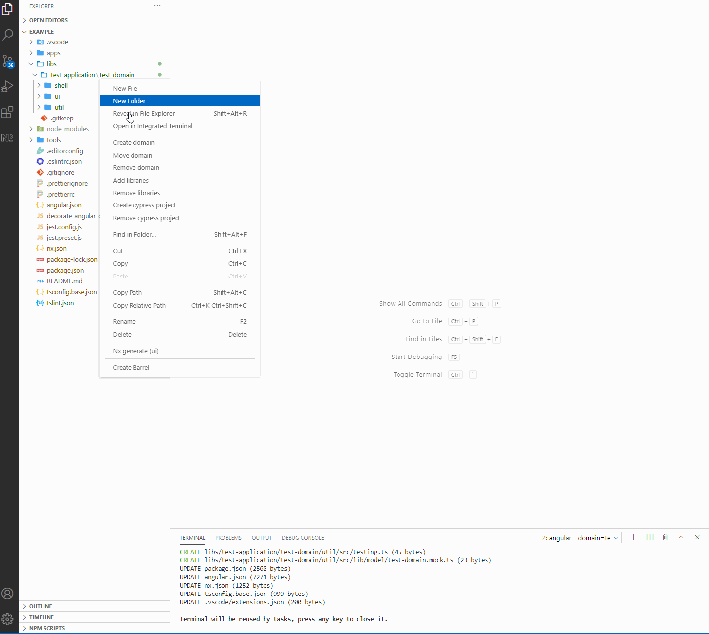
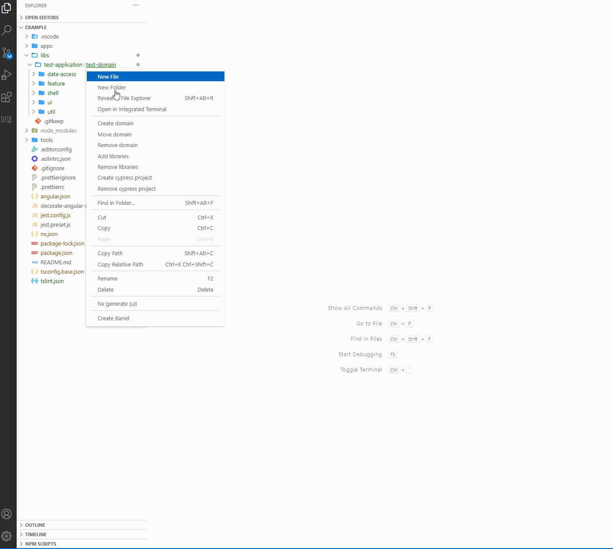
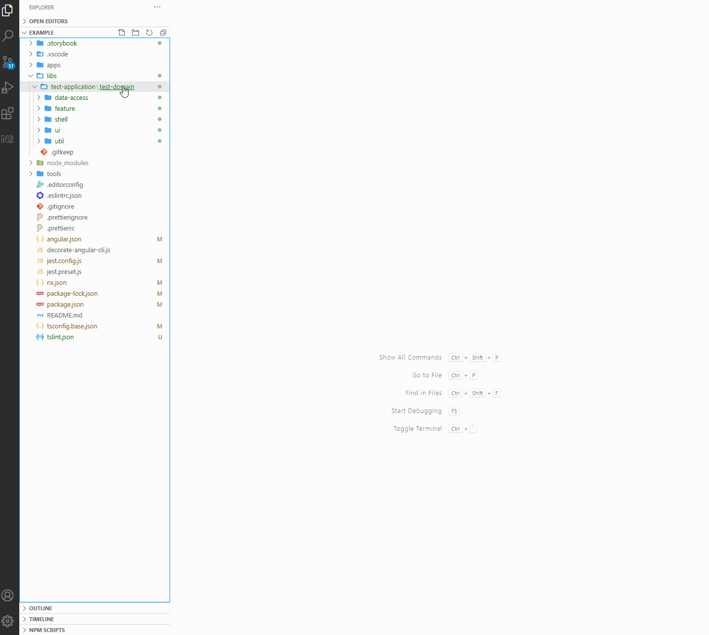
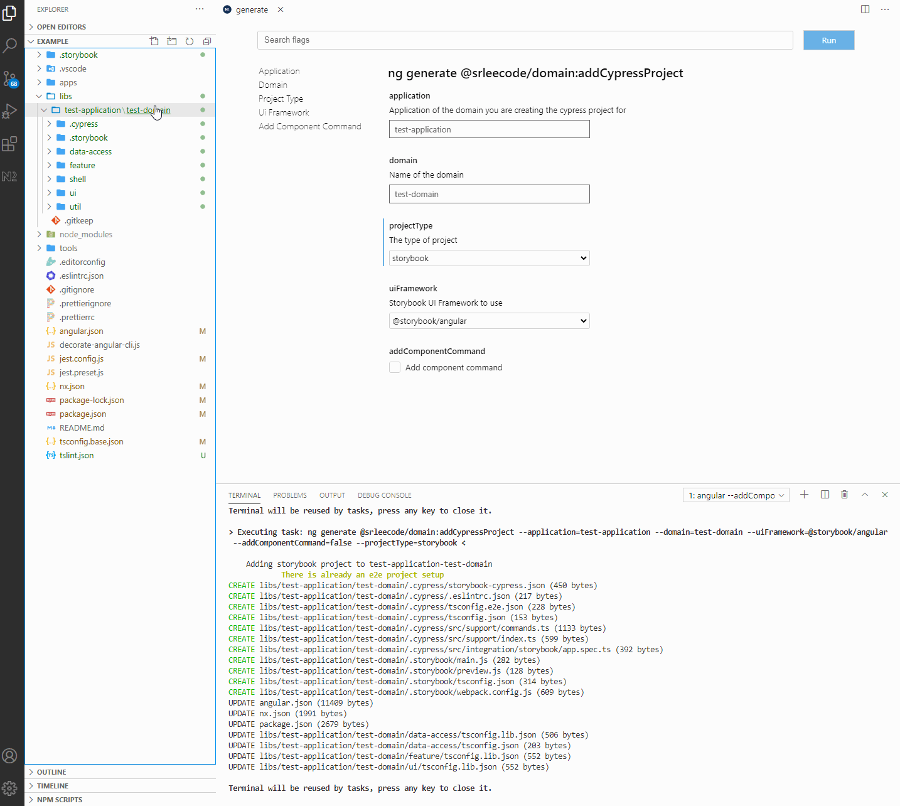

# domain-schematics vscode extension

This extension allows the domain schematics to be more easily used by launching the nx console and adding appropriate default valeus based on the command trigger context.

## Create domain

[Properties:](https://github.com/srlee309/domain/blob/master/packages/domain/src/schematics/create/schema.json)

## Move domain

[Properties:](https://github.com/srlee309/domain/blob/master/packages/domain/src/schematics/move/schema.json)

## Remove domain

[Properties:](https://github.com/srlee309/domain/blob/master/packages/domain/src/schematics/remove/schema.json)

## Add libraries

[Properties:](https://github.com/srlee309/domain/blob/master/packages/domain/src/schematics/add-libraries/schema.json)

## Remove libraries

[Properties:](https://github.com/srlee309/domain/blob/master/packages/domain/src/schematics/remove-libraries/schema.json)

## Add cypress project

[Properties:](https://github.com/srlee309/domain/blob/master/packages/domain/src/schematics/add-cypress-project/schema.json)

## Remove cypress project

[Properties:](https://github.com/srlee309/domain/blob/master/packages/domain/src/schematics/remove-cypress-project/schema.json)